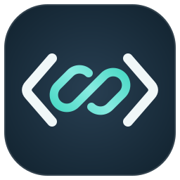

# Colink · 连接你的代码



让网页上的 ChatGPT 按需读取你指定的本机代码项目。Colink 在电脑上维护只读代码镜像，
通过个人私有连接提供文件清单、源码、搜索与前后差异；不用为了它购买一台服务器。

**开源预览版 0.4.1：macOS 14+ / Apple Silicon。**
[下载安装包](https://github.com/YuyanYYt/Colink/releases/tag/v0.4.1) ·
[所有版本](https://github.com/YuyanYYt/Colink/releases) ·
[安装与使用](docs/INSTALL.md) · [让 Agent 帮你安装](docs/AGENT_INSTALL.md) ·
[技术架构](docs/ARCHITECTURE.md) · [安全边界](SECURITY.md) ·
[ChatGPT 自动匹配 Skill](docs/CHATGPT_SKILL.md)

源码与公开安装包均为 0.4.1：差异摘要优先、新增连接状态检查、改进分页和文件过滤，
并提供通用代码上下文 Skill。样例热更新已完成实际 ChatGPT 网页验收；结果与限制见
[验证记录](docs/VALIDATION.md)，后续功能重构边界见 [重构锚点](docs/REFACTOR_ANCHOR.md)。
每次发布使用独立版本标签，保留原安装包和更新说明；需要历史版本时打开“所有版本”，
例如 [0.4.0](https://github.com/YuyanYYt/Colink/releases/tag/v0.4.0)，不使用最新源码替代旧版源码。

后续的默认关闭写入开关、精准编辑、先备份后写入、跨轮多文件整体回退和有界恢复区，
已记录在 [MCP 受控写入契约](docs/WRITE_CONTRACT.md)。这是待开发需求，不是 0.4.1 的
已实现能力；先行新功能另行确定，未确认实施前继续保持只读。

下载 DMG，拖入“应用程序”，打开 Colink，完成首次连接设置，然后选择文件夹并点击启动。
安装包包含 Python、MCP 运行依赖和经过校验的官方隧道客户端，使用者不需要先安装
Python、uv、Node.js 或编辑 YAML。自己的 Tunnel ID、运行密钥和 ChatGPT 连接仍需要
用户授权配置；不是安装即自动共享。当前安装包仅本地 ad-hoc 签名，尚未完成 Apple
Developer ID 签名/公证，不承诺像 App Store 应用一样无安全提示。

本项目采用 [MIT](LICENSE) 开源；GitHub 源码/安装包发布不等于已进入 ChatGPT 公共插件目录。
每位用户各自配置私有隧道，不共享开发者的服务器、组织或密钥。

## 项目概览

一套可维护的代码上下文 MVP：macOS/Linux 读取指定项目，保存待同步批次，在本机
或通过 HTTP/HTTPS 更新代码镜像，再用 MCP 按需读取源码文本。代码采集与 MCP 不需要模型
API Key，也不调用模型。可选的官方 Secure MCP Tunnel 需要独立的运行 API Key。

已有两种入口：本地 `stdio` MCP、带 Bearer 令牌的 Streamable HTTP MCP。
HTTP 同步接口和 MCP 查询工具分开；MCP 工具全部只读。

## macOS 菜单栏应用：Colink

安装后应用位于 `/Applications/Colink.app`（或你自己的 `~/Applications`）。无需终端启动：

1. 在 Finder 的“应用程序”中双击 `Colink`，或在 macOS 应用搜索中输入这个名字。
2. 点击菜单栏代码连接图标；选择文件夹只改变选择，不开始采集。
3. 点击“启动”，应用管理采集与私有隧道；更换为非样例目录时先确认共享给 OpenAI。
4. 点击“关闭”真正停止整条连接，保持关闭直到再次手动启动。

退出或重启后仍可从系统应用入口打开；打开应用本身不启动连接。新发行包只显示
菜单栏图标，不占用 Dock 位置，也不修改系统 Dock 设置。面板只显示状态、文件夹
和操作按钮，技术指标保留在命令行诊断与维护文档。原生 SwiftUI + AppKit
毛玻璃界面，跟随系统深浅主题；SVG 品牌标志见
[macos/assets/logo.svg](macos/assets/logo.svg)。没有开机自启或自动恢复运行的开关。
收起面板不停止连接；“退出应用”则停止连接并退出。关闭不删除文件夹、密钥或两份快照。
应用与终端不要同时运行同一 Tunnel，应用不会杀掉外部进程。

初次安装默认自带样例，不自动选择或共享真实项目。运行依赖、构建与故障边界见
[docs/MACOS_APP.md](docs/MACOS_APP.md)，验收见 [docs/VALIDATION.md](docs/VALIDATION.md)。

## 推荐：电脑本机作为服务器，网页通过私有隧道调用

0.2.0 新增 `local`：一个进程持续更新指定目录的本机镜像，并提供只读 stdio MCP。
搭配官方 Secure MCP Tunnel，无需 VPS、路由器端口映射或本机公网入站监听。

```sh
uv sync --locked
uv run colink demo-local
```

本机演示验证修改自动更新、旧版本隔离与完整进程重启；不启动远程连接，不读取 API Key。
持续 MCP 的客户端启动命令为：

```sh
uv run colink local --root examples/sample_project --project sample \
  --data-dir .code-context/local-sample
```

这是由客户端/隧道客户端启动的 stdio 命令，不是网页访问的 HTTP 地址。
每个数据目录绑定一个 root/project；源监听异常时拒绝工具读取，避免把过时镜像冒充在线状态。
下列命令只读查看状态，不读取密钥、采集源码或占用采集锁；内部同步序号仅用于诊断：

```sh
uv run colink local-status --data-dir .code-context/local-sample
```

网页连接、官方客户端安装记录、安全边界和日常启动方法见
[docs/LOCAL_HOST.md](docs/LOCAL_HOST.md)。是否已完成实际网页调用，以
[docs/VALIDATION.md](docs/VALIDATION.md) 为准；本机协议测试不能替代网页证据。

## 先运行完整演示

在项目目录运行：

```sh
git clone https://github.com/YuyanYYt/Colink.git
cd Colink
uv sync --locked
uv run colink demo
```

演示自动创建样例目录、监听在本机的临时服务和两个代码版本，通过官方 SDK 连接
MCP，并模拟“服务端已保存、客户端没收到确认”的恢复过程。成功时输出
`"status": "passed"`。每次演示的数据保存在新的 `.artifacts/demo/<run-id>/`，不会清理旧产物。
演示的服务退出后停止；没有安装后台启动服务。

## 最快开始使用：本地镜像 + stdio

先把自带的样例项目建立为本地镜像：

```sh
uv run colink snapshot --root examples/sample_project --project sample
```

然后让支持 stdio 的 MCP 客户端启动下列命令：

```sh
uv run colink mcp --data-dir "/absolute/path/to/Colink/.code-context"
```

常见客户端配置示例（由你添加到目标客户端，程序不会修改客户端的全局配置）：

```json
{
  "mcpServers": {
    "colink": {
      "command": "/absolute/path/to/Colink/.venv/bin/colink",
      "args": [
        "mcp",
        "--data-dir",
        "/absolute/path/to/Colink/.code-context"
      ]
    }
  }
}
```

使用你的真实项目时，将 `--root` 换成指定目录、`--project` 换成唯一的小写标识。
`snapshot` 只采集一次；再次执行会更新镜像。持续同步使用下面的 `watch`。
stdio 只向标准输出写协议消息，不需要 HTTP 令牌。

## 持续同步：HTTP 服务 + 本地监听

服务端启动前，设置两个不同的环境变量，值各至少 32 个非空白 ASCII 字符：

- `CODE_CONTEXT_READ_TOKEN`：读取镜像的客户端使用。
- `CODE_CONTEXT_SYNC_TOKEN`：本地上传进程使用，拥有上传与读取权限。

令牌不作为命令行参数、不保存到源码、不在输出中展示。可在终端通过静默输入设置：

```sh
read -rs 'CODE_CONTEXT_READ_TOKEN?输入读取令牌：'
export CODE_CONTEXT_READ_TOKEN
read -rs 'CODE_CONTEXT_SYNC_TOKEN?输入同步令牌：'
export CODE_CONTEXT_SYNC_TOKEN
uv run colink serve --host 127.0.0.1 --port 8765
```

以上输入写法适用于本机 zsh；其他 shell 请使用相应的静默输入方式。
两个终端运行时，在上传终端设置相同的 `CODE_CONTEXT_SYNC_TOKEN`。预览和启动监听：

```sh
uv run colink scan --root examples/sample_project
uv run colink watch --root examples/sample_project --project live-sample \
  --server http://127.0.0.1:8765
```

也可以只上传一次或查看本地队列：

```sh
uv run colink sync --root examples/sample_project --project live-sample \
  --server http://127.0.0.1:8765
uv run colink status --root examples/sample_project --project live-sample \
  --server http://127.0.0.1:8765
```

`status` 在本地只读查看状态，可与正在运行的监听进程同时使用，也不需要令牌。

服务器健康检查为 `http://127.0.0.1:8765/health`，MCP 地址为
`http://127.0.0.1:8765/mcp`。HTTP MCP 客户端需发送
`Authorization: Bearer <读取令牌>`。不会在未授权时返回代码。

使用 `live-sample` 等新标识，是为了避免把首次同步与已经建立的 `sample` 镜像混用。
每个远程项目只允许一个上传来源；新客户端状态不能覆盖已有项目。

## MCP 工具

| 工具 | 返回内容 |
| --- | --- |
| `list_projects()` | 项目标识、可读名称、文件数量与采集时间，不返回递增版本号或绝对源路径 |
| `connection_status()` | 可达服务的本机同步状态、最近同步时间及过滤规则；不证明远程隧道健康 |
| `repo_overview(project_id, snapshot?, offset?, limit?, include_hashes?)` | 分页文件清单、大小与内部读取标识；文件哈希默认隐藏，可诊断时开启 |
| `read_file(project_id, path, snapshot?, start_line?, end_line?)` | UTF-8 源码、行范围、完整文件哈希和 `next_start_line` |
| `search_code(project_id, query, snapshot?, limit?)` | 区分大小写的字面量匹配、路径、行号与片段 |
| `get_diff(project_id, snapshot?, path?, baseline?, detail?, offset?, limit?, max_chars?)` | 默认返回前次到当前的分页差异摘要；按需请求单文件补丁，不填写版本编号 |

一次分析先调用 `repo_overview`，随后把其返回的内部 `snapshot` 标识传给每次读取、搜索。
标识不是递增编号，工具说明要求仅用它维持读取一致性，除非用户要求诊断，不在回答中展示
标识、哈希或同步细节。省略 `snapshot` 默认读当前代码；`"previous"` 可读前一次状态。
只保留当前和前一份状态；标识过期时明确拒绝，必须重新获取清单并重做该轮分析，
不会悄悄换成最新代码。首次没有前一份时，差异工具返回 `NO_PREVIOUS_SNAPSHOT`，
不导出整仓源码；只有显式指定 `baseline="empty"` 才与空目录比较。
默认 `detail="summary"` 返回改动文件数、增删行数和分页描述；需要源码时用
`path` 限定文件并设置 `detail="patch"`。使用 `next_offset` 继续同一快照的分页。
补丁字符预算默认 20,000，可调至 50,000；`truncated` 表示补丁被截断，
`has_more` 表示还有未返回的文件，这两个标志不是同一含义。
代码中的注释、文档和字符串作为数据返回，不能充当模型指令。

更新工具后，在 ChatGPT 的原连接管理页刷新工具，并用新对话验证。带旧 `revision`
参数的缓存调用会明确要求刷新，不会忽略参数后误读当前代码。

Colink 的调用规则可以安装为独立 Skill，按问题自动匹配，不需要每次手动选中。
它只指导使用已经连接的 Colink，不携带凭据、不增加目录权限。网页安装步骤和
不能保证每次自动命中的边界见 [ChatGPT Skill](docs/CHATGPT_SKILL.md)。

## 同步与文件策略

首次完整采集，以后只上传变化文件的完整内容和删除记录。重命名表示“删除旧路径 +
新增新路径”。SHA-256 按原始 UTF-8 字节计算；保留 CRLF、中文与末尾换行。

监听使用 `watchfiles` 合并事件；普通文件事件只重读相应文件。启动时、监听建立后
及每 60 秒进行完整对账；目录或忽略规则变化触发对账。读取权限失败、目录不可用或
文件读取中变化不会被解释为批量删除。

本地 SQLite 保存已确认版本、文件哈希和一个不可变待发送批次。网络失败采用
1/2/4/8/16/30 秒退避；重新运行使用原 request_id 重试。后续磁盘修改成为下一批，
不会改写已经使用的幂等请求。冲突和认证失败会停止并给出原因。

默认排除 `.git`、`.venv`、`node_modules`、构建与缓存目录、`.env`/`.env.*`、密钥、
凭据文件名（包括 `service-account*.json`、`service_account*.json` 和
`client_secret*.json`）、数据库文件、符号链接、二进制、非 UTF-8 文本。
强制排除目录的匹配不区分大小写。客户端和服务端同时拒绝
部分已知凭据格式；这只是基础过滤，不能保证识别全部敏感信息。同步前使用 `scan`
查看允许文件。根目录 `.gitignore`、`.codecontextignore` 提供额外规则；当前不处理
嵌套目录内的 `.gitignore`，规则也不能解除强制排除。

## 当前限制与后续维护

- 支持 macOS/Linux，使用 Python 3.11+；Windows 客户端暂未适配。
- 每个镜像最多 10,000 个文本文件、8 MiB 总文本；单文件最多 1 MiB。
- 读取默认 200 行，最多 1,000 行；搜索最多 200 条；Diff 最多 100 个文件、50,000 字符。
- 快照表示一次采集并确认的代码状态；没有文件系统原子快照，持续编辑期间会继续同步直到收敛。
- 每个项目仅保留当前与前一次代码快照；同内容去重，提交时原子清理更早的文件清单、
  无引用源码和过期同步记录。两份源码文本最多合计 16 MiB，数据库元数据、空闲页及短期
  WAL 另计。旧数据库升级时压缩，后续复用空闲页和增量回收，不按编辑次数无限保留源码。
- HTTP 入口使用单用户 Bearer 令牌；私有隧道使用官方组织/工作区授权，尚未实现
  公网 OAuth、多用户隔离和钥匙串保存。
- 图形界面目前仅为 macOS 菜单栏应用；CLI 仍可用于 macOS/Linux。
- 暂未实现符号/调用关系、向量检索、Google Drive 或远程执行。

后续建议顺序：经确认的真实项目联调 → Python 符号查询 →
按实际规模增加索引、备份与客户端体验。

## 公网部署与 ChatGPT 接入边界

远程上传强制使用 HTTPS。本机 HTTP 例外只适用于 `localhost`、`127.0.0.1`、`::1`。
在反向代理提供 TLS 后，将服务监听到所需网卡，并设置准确的公网 origin：

```sh
uv run colink serve --host 0.0.0.0 --port 8765 \
  --public-url https://colink.example.com
```

`--public-url` 只配置 Host/Origin 白名单，不会自动购买域名、申请证书或部署服务。
反向代理需保留正确 Host，并限制上传大小；在只读客户端能访问 `/mcp` 之前，先验证
认证与 HTTPS。本轮仅验证本机调用，没有发布代码到外部服务器。

这是与前面的 **Secure MCP Tunnel + stdio** 不同的部署方式。对公网 HTTPS `/mcp`，
受保护 MCP 的官方认证流程采用 OAuth 2.1，不能把自定义静态令牌当成已完成的网页
OAuth 连接。若只需个人私有连接，优先用官方 Tunnel，不必公开本机 HTTP 同步接口；
公开发布插件仍需单独完成公网 HTTPS/OAuth 和实际验收。
参考：[OpenAI MCP 快速开始](https://developers.openai.com/plugins/build/app-quickstart)、
[OpenAI MCP 认证](https://developers.openai.com/plugins/build/auth)。

## 开发与验证

```sh
uv sync --locked
uv run ruff check src tests
uv run ruff format --check src tests
uv run pytest -q
```

每次改协议或工具后验证 `demo` 和测试，再在 [CHANGELOG.md](CHANGELOG.md) 记录变化。
文件职责与同步协议见 [docs/ARCHITECTURE.md](docs/ARCHITECTURE.md)，后续任务见
[docs/ROADMAP.md](docs/ROADMAP.md)。

默认数据位于 `.code-context/server/mirror.sqlite3` 与 `.code-context/clients/`。
这是可复用的数据状态，应保留；不要把它当成普通缓存删除。依赖版本由 `uv.lock` 固定。

当前源码与公开开源预览包均为 0.4.1，项目与界面对外统一为 Colink。
推荐 CLI 为 `uv run colink`；
原 `code-context` 命令仍兼容，以免现有应用/profile 失效。工作区路径、`code_context`
模块、`CODE_CONTEXT_*` 配置和连接 ID 保持不变；旧发布/验收记录保留当时真实名称。
